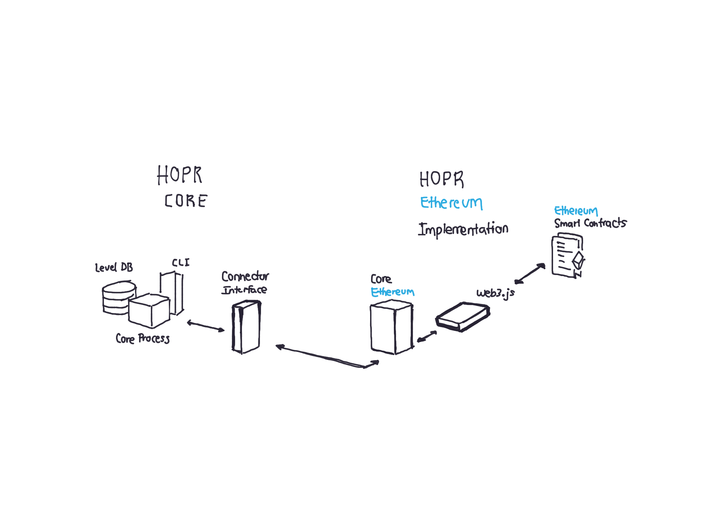

# Overview

The HOPR ecosystem is a two-platform network with dynamic components powering its communication and incentivization mechanisms.

**HOPR Core** is our privacy-networking protocol able to communicate and transfer messages securely. This is complemented by a **payment gateway**, which is a distributed ledger technology \(DLT\) or blockchain infrastructure able to open payment channels on behalf of nodes running in the HOPR Network.

In its first implementation, HOPR relies on the **Ethereum blockchain** as its first payment gateway. Using **Ethereum smart contracts**, we can open **state channels** on behalf of the relayers while forwarding messages. Message senders attach **$HOPR** tokens in their messages, which upon successful delivery are paid to the relayers involved.

To achieve this, a HOPR node implements a **connector interface** that communicates to the Ethereum network using its popular web library, **Web3.js.** These interfaces allow HOPR nodes to monitor, approve, sign and verify when a message is transfered, and thus close a state channel and receive their earned $HOPR. Each node verifies each other, avoiding foul play and rewarding only **honest relayers**.

Although the first instantiation of the HOPR network is on the Ethereum network, HOPR is **chain agnostic,** which means that HOPR nodes can eventually implement different payment channels in different blockchains. At the time of writing, HOPR is also able to implement a [Polkadot-enabled payment gateway.](https://github.com/hoprnet/hopr-polkadot)

