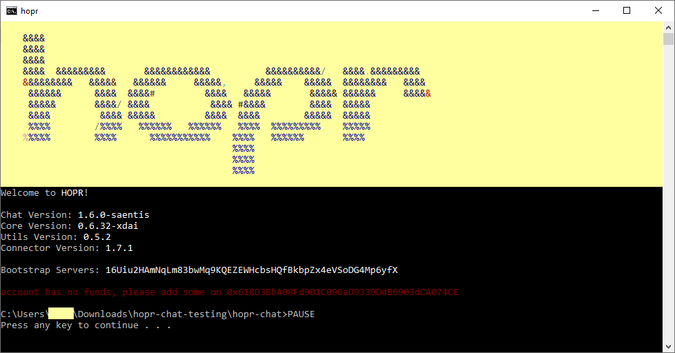

# Säntis for Previous Users

If you've already run HOPR Chat before, you can connect to Säntis in no time.  
  
To get started as quickly as possible, visit https://saentis.hoprnet.org and follow the instructions there. If you need more help, this short guide will take you through the process step by step.

### Step 1: Connect to the HOPR Network

To start using the testnet and making your way up the leaderboard, you'll need to register your HOPR node with our bot, which will then be able to track your score and send you xHOPR tokens for relaying data.  
  
There are two ways to connect to the testnet:

* With the HOPR Chat client
* Using a HOPR Node PC or other hardware node

#### Connecting Using HOPR Chat

To connect using HOPR Chat, you'll need to download the latest version.



[Download the latest Windows release](https://github.com/hoprnet/hopr-chat/releases/download/v1.6.0-saentis/hopr-chat-nodebin-windows.zip)



[Download the latest MacOS release](https://github.com/hoprnet/hopr-chat/releases/download/v1.6.0-saentis/hopr-chat-nodebin-macos.zip)



[Download the latest Linux release](https://github.com/hoprnet/hopr-chat/releases/download/v1.6.0-saentis/hopr-chat-nodebin-linux.zip)




If this is your first time using HOPR Chat, you'll need to install node.js or Docker. we recommend following the [HOPR Chat Quickstart Guide](https://docs.hoprnet.org/home/getting-started/hopr-chat/quickstart) to do this.


**Connecting Using a HOPR Node PC**

If you have a HOPR Node PC, it should automatically updated to the latest version of HOPR Säntis. All you have to do is fund your node, as explained in the next section, and then restart.


The node will ask you to send 0.1 xDAI to your account. This is a typo. You only need to send 0.01 xDAI. Apologies, and we'll update this in the next version.


### Step 2: Fund Your Node

Next, you need to send xDAI to your HOPR node. You currently need 0.01 xDAI in your node address to participate in the testnet. If your node doesn't have enough xDAI, HOPR Chat will not start.


xDAI is a USD stablecoin, so 0.01 xDAI is worth around 1 cent.


If your node is unfunded, you can find your HOPR address by simply starting the HOPR Chat client. HOPR Chat will recognize that your node is unfunded, and won't proceed. It will tell you your address, so you can send xDAI.

If you need more instructions on how to buy and send xDAI, see the next section: Funding Your Node


We're working on allowing withdrawals from your HOPR node, but for now you should consider the xDAI you send to your node irretrievable. We don't recommend sending more than the minimum xDAI to your node. Having more will not affect your score or the rate at which you receive xHOPR.


### Step 3: Send a Tweet

Next, you need to send a tweet which will be used to verify your participation in the network. This is just a basic check to prevent people from entering multiple times.  
  
Your tweet needs to include your HOPR address, tag the @hoprnet account, and include the hashtag \#HOPRNetwork. An example is show below.   
  
The bot should be able to parse any tweet which includes these three things, so feel free to add comments and even emojis. But if you're having difficulty registering, try again with a simpler tweet.


**Don't delete this tweet!** The CoverBot will continuously check that the tweet associated with your address still exists. If the check fails, your address will be removed from the bot's database and you won't be able to earn any more points.


### Step 4: Turn On includeRecipient

The HOPR network is fully anonymous by default. That means no-one can see who you're sending messages to, not even the recipient.  
  
Obviously, in most use cases we want people who we contact \(but not anyone else!\) to know who is sending them data, so they know who to send data back to and where to send it.

Type `includeRecipient`and then type `y` to confirm. From now on, every message you send will also be sent with your address. Now when you message the CoverBot, it will know your address and will be able to reply and add you to its database.

### Step 5: Register With The Bot

Now that you've sent your tweet, and turned on `includeRecipient`, you need to register with the bot. Copy the full URL of your tweet and send it as a message in HOPR Chat to the bot.  
  
Type `send 16Uiu2HAmAdZNE1VqtbPt4uk9rTypbifLG9eesb8PVb5NjAywGQ4j` then press Enter. Now paste the URL of your tweet and press Enter again. The bot will now check your tweet and will send you a verification message if you're successful.


If this is the first time you've registered this node / tweet in the testnet, you'll receive 10 points!


### Step 6: Stay Online to Earn Points!

Now that your address is whitelisted with the bot, you can score points by relaying cover traffic and receiving xHOPR tokens.  
  
Every 60 seconds, the bot will randomly select an address from the whitelist and ping it to check that it's online. If is, it will send cover traffic to itself via that node.

If the CoverBot selects your address, you'll receive an xHOPR token and a point will be added to your score. You'll also receive a verification message.


The more your node is online, the greater your chance of scoring points, so try to maximize your node uptime. But if your node does go offline, you can re-register with the bot by sending it your tweet again.


