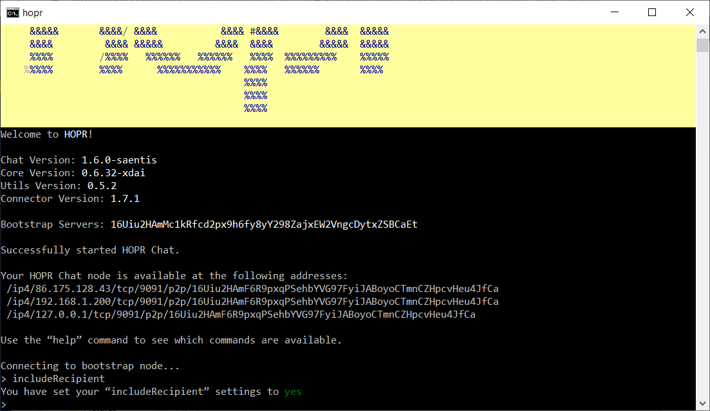

# Talking with RandoBot


HOPR Säntis has ended. Thank you to everyone who participated. We'll be launching a new testnet soon, codenamed Basòdino. Check back soon for more updates.


Before going forward, we highly recommend to talk to Randobot, our connection verification bot that talks back to you when spoken. This will help you and the HOPR team verify that your network is configured in a way that can reach other users in the HOPR network.


RandoBot is one in a series of bots running on the HOPR network which will be familiar from participants in our regular bounties and gaming sessions. We'll be adding more bots to Säntis as the testnet progresses, including more ways to earn points.


## Step 1: Turn On includeRecipient

The HOPR network is fully anonymous by default. That means no-one can see who you're sending messages to, not even the recipient.

Obviously, in most use cases we want people who we contact \(but not anyone else!\) to know who is sending them data, so they know who to send data back to and where to send it.

Type `includeRecipient`and then type `y` to confirm. From now on, every message you send will also be sent with your address. Now when you message the RandoBot, it will know your address and will be able to reply and add you to its database.




You can always see whether you have turned on `includeRecipient` by running the `settings` command.


## Step 2: Alias The Bot

Since HOPR Addresses can be usually hard to remember, we created the `alias` command, which allows you to save a HOPR Address in memory for the duration of your HOPR Chat session. Within HOPR Chat, you can simply run `alias` to learn about its usage.

```text
> alias
usage: <PeerId> <Name>
```

You will want to `alias` the following address, which is the address of randobot in our Säntis network.

```text
16Uiu2HAm17N3psi92XKnRex8mbWJVoqafzJa6fhVN4zHmoLMt15A
```


Bear in mind the address of RandoBot might change over time. If you are unable to `ping` or `send` message to it, make sure to come back to our documentation to verify its address has remained the same.


Within HOPR Chat, then run the following:

```text
alias 16Uiu2HAm17N3psi92XKnRex8mbWJVoqafzJa6fhVN4zHmoLMt15A randobot
```

Confirm your aliased address by running `settings`. It should look something like the following:

```text
> settings
includeRecipient      true
aliases               randobot=16Uiu2HAm17N3psi92XKnRex8mbWJVoqafzJa6fhVN4zHmoLMt15A,
```

## Step 3: Say Hi to RandoBot

Now that you have aliased RandoBot, you are ready to say hi. Using the send command, write send randobot, press Enter, and simply write hi, and press Enter again.

```text
> send randobot
Type your message and press ENTER to send:
hi
```

If successful, RandoBot will pick a series of random words and say those to you. They are random, so don't get offended!

```text
---------- New Packet ----------
Destination    : 16Uiu2HAm17N3psi92XKnRex8mbWJVoqafzJa6fhVN4zHmoLMt15A
--------------------------------
> 
===== New message ======
Message: 16Uiu2HAm17N3psi92XKnRex8mbWJVoqafzJa6fhVN4zHmoLMt15A slimy olden dove
Latency: 63 ms
========================
```

Congratulations! You have successfully sent a message through the HOPR Säntis Network!


In case you get a `Timeout Error,` please run `crawl` a few times. At the beginning of your HOPR Chat session, your node might have yet to discover RandoBot, so try again later or report your error to our [Discord](https://discord.gg/5FWSfq7) channel.



